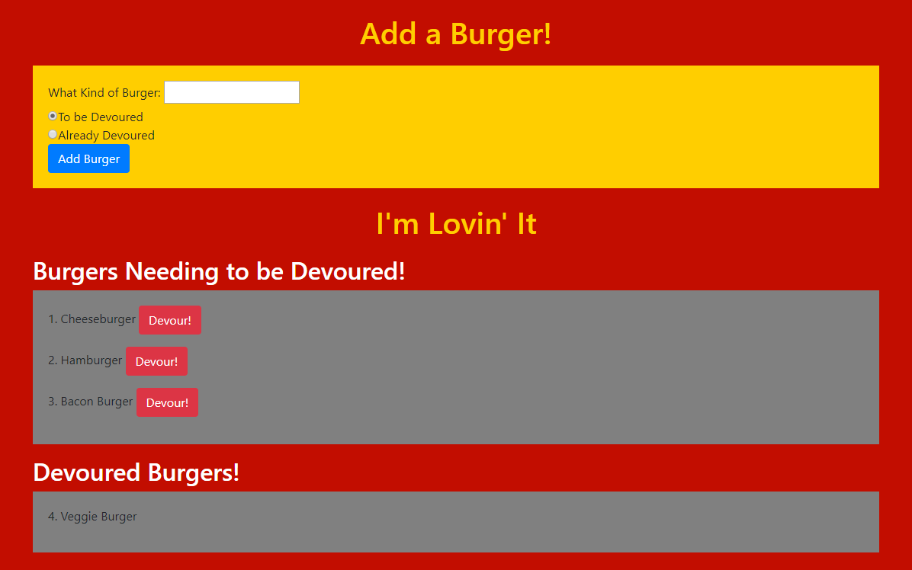

# Eat-Da-Burger

Users input the name of a burger and the app will display it. Each burger waiting has a devour button. When the user clicks it, the burger will move to the bottom of the page. The app will store every burger in a database, whether devoured or not.

# 

# Node-Express-Handlebars

Having difficulty deploying to Heroku, will still work on it.